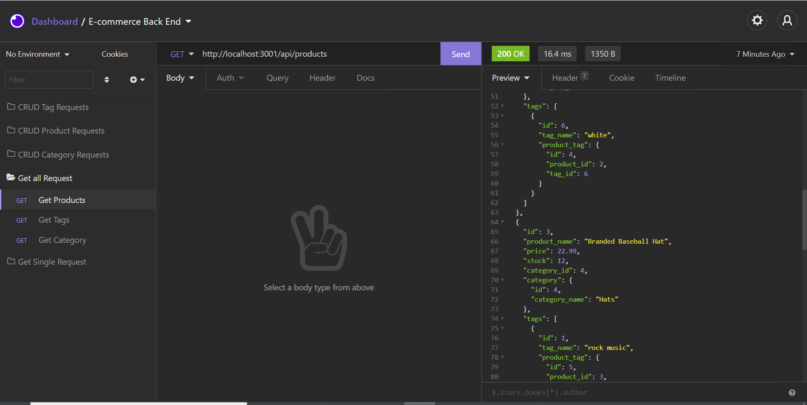
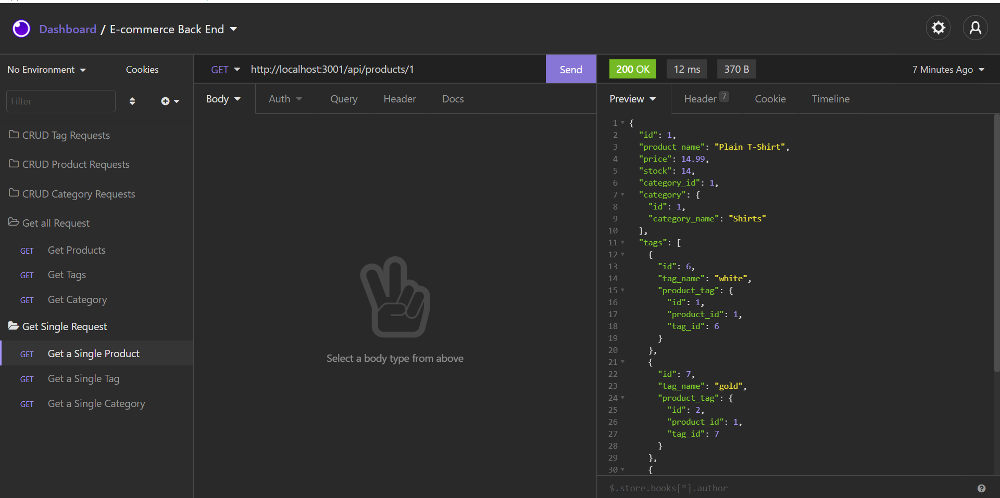

# E-commerce Back End 

# Description

My challenge is to build the back end for an e-commerce site.I toke a working Express.js API and configure it to use Sequelize to interact with a MySQL database. Because this application won’t be deployed, I created a walkthrough video that demonstrates its functionality and all of the following acceptance criteria being met. I have added a link to the video inside the README of my project.




# Pre-requisites

- Install [Node.js](https://nodejs.org/en/) version 8.0.0

# Getting started

- Clone the repository

```
git clone <git@github.com:shanebramble/e-commerce.git> 
```

- Install dependencies

```
cd <project_name>
npm install
```

- Build and run the project

```
npm start
```

### Built With

- JavaScipt
- Node.js
- MySQL
- Sequelize (NPM Package)

## Contribution

Made with ❤️ by Shane Bramble-Wade

### ©️2021 E-commerce Back End , Inc